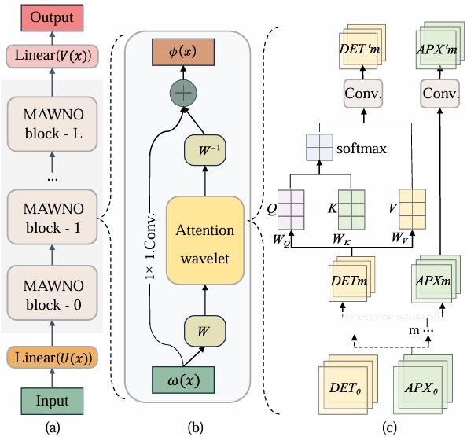

## Introduction

---
This repository contains the code implementation of the **Multiscale Attention Wavelet Neural Operator for Capturing Steep Trajectories in Biochemical System**

For more information, please refer to the following: 
+ Jiayang Su,Junbo Ma, Songyang Tong, Enze Xu, and Minghan Chen "[Multiscale Attention Wavelet Neural Operator for Capturing Steep Trajectories in Biochemical Systems[C]//Proceedings of the AAAI Conference on Artificial Intelligence. 2024, 38(13): 15100-15107.](https://ojs.aaai.org/index.php/AAAI/article/view/29432)"
# MAWNO Structure

---
MAWNO is a neural operator method that combines wavelet transform and self-attention, and its structure is as follows.

[//]: # ( &#40;&#41;)

# Requirements

---
Environment requirements are installed by running:
>pip install -r requirements.txt

In addition, you also need to install the following packages to run the code of MAWNO
+ [Wavelet Transforms in Pytorch](https://github.com/fbcotter/pytorch_wavelets)

# Files

---
For the convenience of readers, the following is a brief description of the file
+ `mawnonet`:This is the main file of MAWNO, which contains the code implementation of the MAWNO neural network
+ `mawno_Goodwin`:This code implements the use of MAWNO to model Goodwin
+ `config_Goodwin`:This code is the configuration file for the creature model Goodwin
+ `mawno_Brusselator`:This code implements the use of MAWNO to model Brusselator
+ `config_Brusselator`:This code is the configuration file of the biochemical model Brusselator
+ `mawno_MPF`:This code implements the use of MAWNO to model MPF
+ `config_MPF`:This code is the configuration file for the creature model MPF
+ `sa_ode`:This code implements self-attention
+ `utils` and `utils_pinn`:contains some useful functions

# Running
You can run mawno_Goodwin with the following code.
> python mawno_main\mawno_Goodwin.py

Similar methods can be applied to run `mawno_Brusselator.py` and `mawno_MPF.py`

# Citing
If you use MAWNO in an academic paper, please cite us at,
~~~
@inproceedings{su2024multiscale,
  title={Multiscale Attention Wavelet Neural Operator for Capturing Steep Trajectories in Biochemical Systems},
  author={Su, Jiayang and Ma, Junbo and Tong, Songyang and Xu, Enze and Chen, Minghan},
  booktitle={Proceedings of the AAAI Conference on Artificial Intelligence},
  volume={38},
  number={13},
  pages={15100--15107},
  year={2024}
}
~~~
